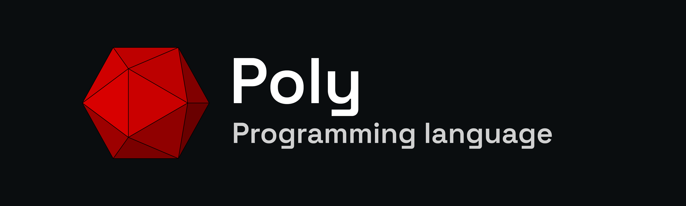

# The Poly programming language

**Poly** is a high-level, objet-oriented, general purpose programming language that is currently in development.
It is strongly and statically typed, and features type inference.
Poly code is designed to be executed by the Java Virtual Machine (JVM),
thus making it memory-safe, garbage-collected and interoperable with Java, Kotlin and Scala.

Code written in Poly is meant to be familiar, modern and elegant.
One of the core feature of Poly is to reduce the boilerplate and verbosity of traditional object-oriented languages,
while still making it friendly and easy to learn for beginners and professionnals alike.

The Poly programming language contains most of the features from every highly-used programming languages,
as well as new and unique features.

The Poly programming language was invented and designed by Vincent Philippe (@vincent64).

> The **Poly programming language** is currently in its early phase.
> This means language features can be added, updated or removed at any time,
> as well as standard library features.
> 
> If you notice a bug when compiling your code, please raise an issue.
> If you want to improve the language or suggest a feature, please do so in the _Issues_ tab.
> New class suggestions or implementations for the standard library are more than welcome!

---

## Documentation
The documentation for the Poly programming language and its standard libary can be found [here](documentation/Documentation.md).
Alternatively, you can view the documentation on the official [website](https://poly-language.dev/documentation).

## Changelogs
The changelogs for updates can be found [here](documentation/Documentation.md).

## Getting started
The Poly Development Kit (which includes the compiler) can be downloaded from the [Releases](https://github.com/vincent64/poly-language/releases) tab.
Make sure to download the latest version in order to benefit from most feature.

For more information on how to get started, check the [documentation](documentation/Getting-started.md).

## Contributing
Did you find a bug in the language or the compiler?
Raise an issue in the [Issues](https://github.com/vincent64/poly-language/issues) tab.

Do you want a feature to be added in the language or the standard library?
Create an issue with the tag _Feature_ in the [Issues](https://github.com/vincent64/poly-language/issues) tab.

Do you have questions related to how the language works?
Refer to the [documentation](https://github.com/vincent64/poly-language/tree/documentation/Documentation.md),
or ask your question on [StackOverflow](https://stackoverflow.com) with the _Poly_ tag.

**Important :** Make sure to read the contribution [page](CONTRIBUTING.md) before contributing!

## License
The Poly programming language compiler and the Poly standard library are licensed under the Mozilla Public License (MPL).
You can view the license [here](LICENSE).

The name _Poly_ and the red icosahedron logo are trademarks licensed under the CC BY-ND 4.0.
You can view the license [here](TRADEMARK).

---

## Credits
The Poly programming language was invented and designed by Vincent Philippe (@vincent64).

The name _Poly_ and the red icosahedron logo are trademarks of Vincent Philippe.
Unauthorized use of the name or logo in modified versions, forks, or other derivative works is prohibited without explicit written permission from Vincent Philippe.

The name _Java_ and the Java logo are trademarks or registered trademarks of Oracle and/or its affiliates.
This project is not affiliated with, endorsed by, or sponsored by Oracle Corporation.